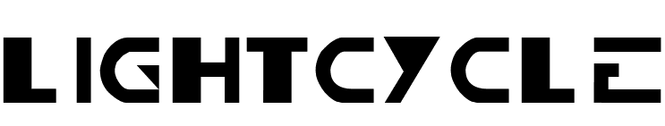

<div align="center">
  

  A Tron-inspired Light Cycle game built as a Progressive Web App using Svelte and PixiJS. Race through the grid, create light walls, and try to outmaneuver your opponent!

  [Play Now](https://thatplatypus.github.io/LightCycle/) 🎮
</div>

## Features

- 🎮 Single-player mode with increasing difficulty
- 👥 Local multiplayer mode (keyboard controls)
- 📱 Mobile-friendly with touch controls
- 🎵 Retro-style sound effects and background music
- ⚡ Smooth animations and particle effects
- 🎨 Customizable bike colors
- 🌓 Responsive design that works on all devices

## Controls

### Desktop
- Player 1: Arrow keys
- Player 2: WASD keys (local multiplayer)
- ESC: Pause game

### Mobile
- Swipe in any direction to turn

## Technology Stack

- 🎯 [SvelteKit](https://kit.svelte.dev/) - Web framework
- 🎨 [PixiJS](https://pixijs.com/) - 2D rendering engine
- 💅 [TailwindCSS](https://tailwindcss.com/) - Styling
- 🎭 [shadcn-svelte](https://shadcn-svelte.com/) - UI Components
- 🌈 [Lucide Icons](https://lucide.dev/) - Beautiful icons
- 🎵 Web Audio API - Sound effects
- 📱 Progressive Web App features
- 🔧 TypeScript - Type safety

## Development
Clone the repository
```bash
git clone https://github.com/thatplatypus/LightCycle.git
```

Install dependencies
```bash
npm install
```

Start development server
```bash
npm run dev
```

Build for production
```bash
npm run build
```

## Contributing

Contributions are welcome! Feel free to open issues or submit pull requests.

## License

MIT License - feel free to use this code in your own projects!

## Credits

### Audio 

- **Background Music**
  - "Tron World" by RokZRooM ([freesound](https://freesound.org/s/444082/)) - License: Attribution NonCommercial 4.0
  - "Tron Forest" by RokZRooM ([freesound](https://freesound.org/s/444561/)) - License: Attribution NonCommercial 4.0

- **Sound Effects**
  - "Futuristic.aif" by InAvision ([freesound](https://freesound.org/s/479258/)) - License: Creative Commons 0
  - "derezz_sounds.wav" by Syna-Max ([freesound](https://freesound.org/s/69966/)) - License: Attribution NonCommercial 4.0
  - "Sci-Fi Engine - Light Cycle.wav" by fedexico ([freesound](https://freesound.org/s/136672/)) - License: Attribution 3.0
  - "Mono tron bike engine.wav" by Hiccupvirus ([freesound](https://freesound.org/s/33479/)) - License: Attribution 3.0

### Inspiration
- Inspired by the Light Cycles from the Tron franchise